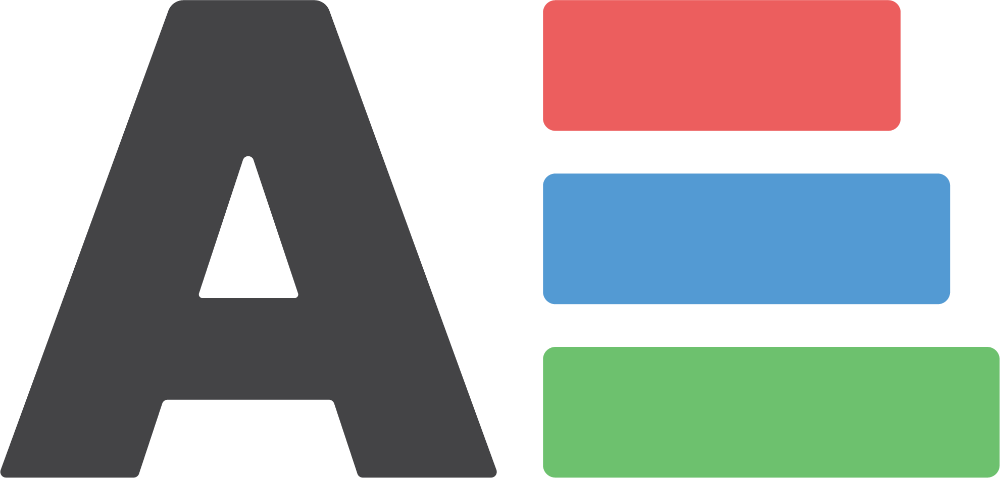
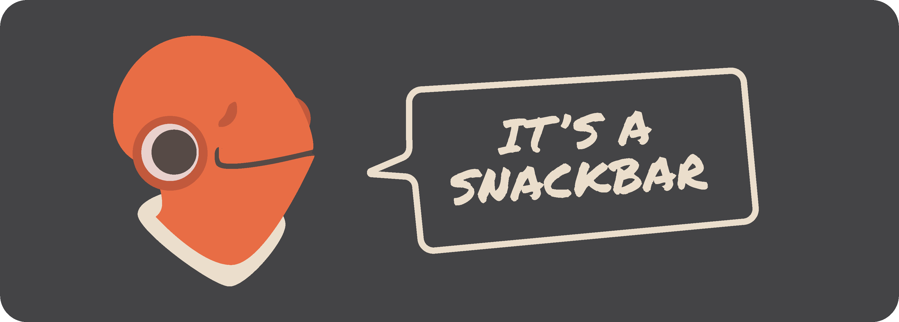

# \<ackbar-snackbar>

A small, very easy to use and highly customisable snackbar component to use on any project.




## Table of Contents  
- [Installation](#installation)  
- [Getting Started](#getting-started)  
- [Options](#options)
    - [AnimationDuration](#animation-duration)
    - [AnimationName](#animation-name)
    - [buttonCallback](#button-callback)
    - [buttonText](#button-text)
    - [duration](#duration)
    - [message](#message)
    - [type](#type)
    - [variant](#variant)
- [Attributes](#attribtues)
    - [position](#position)
- [CSS Variables](#css-variables)


## Installation
```bash
npm i ackbar-snackbar
```


## Getting Started
1. Import the module into your project    
    ``` html
    <script src="../ackbar-snackbar.js" type="module"></script>
    ```

2. Add the element to your page (for instance as the last element before the `</body>`)
    ```html
    <ackbar-snackbar></ackbar-snackbar>
    ```

3. To add a snackbar, dispatch a `ackbar-snackbar-add` event from any element on your page
    ```js
    const snackbarOptions = {
        duration: 4000,
        message: `This is an awesome snackbar`,
        variant: 'success'
    }
   
    window.dispatchEvent(new CustomEvent('ackbar-snackbar-add', {
        bubbles: true,
        composed: true,
        detail: snackbarOptions
    }));
    ```


## Options
There are several options that you can customize when you create a snackbar.

To set any option, just pass it into the snackbar options object in the `ackbar-snackbar-add` event. For instance to set a custom animation name
```js
window.dispatchEvent(new CustomEvent('ackbar-snackbar-add', {
  bubbles: true,
  composed: true,
  detail: {
    message: `This is an awesome snackbar`,
    animationName: 'slide-in',
  }
}));
```

If an option isn't passed in the options object, the default value will be used.

### Animation Duration
Set the duration of the show and hide animations (in milliseconds).

| Option Name | Default  | Type     | Required  |
|:----------- | -------- | -------- | ---------:|
| 'animationDuration' | 500 | Number | no |

Example: 
```js
// Set custom animation duration
const snackbarOptions = {
  message: 'This is the snackbar message',
  animationDuration: 1000
}
```

### Animation Name
Choose which animation you want to use to show / hide the snackbar

| Option Name | Possible values | Default  | Type     | Required  |
|:----------- | --------------- | -------- | -------- | ---------:|
| 'animationName' | 'default', 'slide-in', 'zoom' | 4000 | String | no |

Example: 
```js
// Set custom animation name
const snackbarOptions = {
  message: 'This is the snackbar message',
  animationName: 'slide-in'
}
```

### Button Callback
You can specify a callback function that will be called when the snackbar button is clicked

| Option Name | Default  | Type     | Required  |
|:----------- | -------- | -------- | ---------:|
| 'buttonCallback' | null | Function | no |

Example:
```javascript
// Set a custom callback function
const snackbarOptions = {
  message: 'This is a snackbar message',
  buttonCallback() { console.log('Hello World') }
}
```

### Button Text
Set the text to be displayed on the snackbar button.

| Option Name | Default  | Type     | Required  |
|:----------- | -------- | -------- | ---------:|
| 'buttonText' | null | String | no |

Example:
```javascript
// Set custom button text
const snackbarOptions = {
  message: 'This is a snackbar message',
  buttonText: 'OK'
}
```

### Duration
Set how long the auto snackbar (refer to [type](###type)) will be displayed (in milliseconds).

| Option Name | Default  | Type     | Required  |
|:----------- | -------- | -------- | ---------:|
| 'duration' | 4000 | Number | no |

Example:
```javascript
// Set custom duration
const snackbarOptions = {
  message: 'This is a snackbar message',
  duration: 8000
}
```

### Message
Set the message that will be shown on the snackbar.

| Option Name | Default  | Type     | Required  |
|:----------- | -------- | -------- | ---------:|
| 'message' | 'Ackbar snackbar: It's a snackbar' | String | yes |

Example:
```javascript
// Set custom duration
const snackbarOptions = {
  message: 'This is a super cool snackbar message',
}
```

### Type
Set the type to choose between a snackbar that is automatically dismissed or a snackbar that stays visible until the user clicks the dismiss button.

| Option Name | Possible values | Default  | Type     | Required  |
|:----------- | --------------- | -------- | -------- | ---------:|
| 'type' | 'auto', 'dismiss' | 'auto' | String | no |

Example:
```javascript
// Set custom duration
const snackbarOptions = {
  message: 'This is a super cool snackbar message',
  type: 'dismiss'
}
```

### Variant
Choose one of the different snackbar variants

| Option Name | Possible values | Default  | Type     | Required  |
|:----------- | --------------- | -------- | -------- | ---------:|
| 'variant' | 'default', 'success', 'warning', 'error', 'info' | 'default' | String | no |

Example:
```javascript
// Set custom duration
const snackbarOptions = {
  message: 'This is a super cool snackbar message',
  type: 'dismiss'
}
```

### Size
Set the size of the snackbar

| Option Name | Possible values | Default  | Type     | Required  |
|:----------- | --------------- | -------- | -------- | ---------:|
| 'size' | 'small', 'normal', 'large' | 'normal' | String | no |

Example:
```javascript
// Set custom duration
const snackbarOptions = {
  message: 'This is a super cool snackbar message',
  size: 'small'
}
```


## Attributes
You can also set some attributes directly on the element.

### Position
Set the position of the snackbars on the screen

| Attribute Name | Possible values | Default  | Type     | Required  |
|:-------------- | --------------- | -------- | --------- | --------:|
| 'position' | 'top left', 'top center', 'top right', 'middle left', 'middle center', 'middle right', 'bottom left', 'bottom center', 'bottom right' | 'bottom left' | String | no |

Example:
```html
<!-- set snackbar container position -->
<ackbar-snackbar position="top right"></ackbar-snackbar>
```


## CSS Variables
You can further customize the snackbars by adding your custom styles using the available custom CSS Variables

Example:
```css
/* Add to your css */
acbar-snackbar {
    --ackbar-color-success: green;
}
```

### Variables
| CSS Variable Name | Description | Default  |
|:----------------- | ----------- | --------:|
| '--ackbar-color-bg' | Background color of the default snackbar | rgb(53, 53, 53) |
| '--ackbar-color-success' | Background color of the success variant snackbar | rgb(105, 199, 109) |
| '--ackbar-color-error' | Background color of the error variant snackbar | rgb(234, 94, 94) |
| '--ackbar-color-warning' | Background color of the warning variant snackbar | rgb(241, 153, 78) |
| '--ackbar-color-info' | Background color of the info variant snackbar | rgb(47, 162, 255) |
| '--ackbar-color-text' | Message text color on success, error, warning and info variants | rgb(255, 255, 255) |
| '--ackbar-color-button-default' | Button text color | rgb(149, 104, 228) |
| '--ackbar-color-button-hover-background' | Button background color on hover | rgba(0, 0, 0, .1) |
| '--ackbar-padding-normal' | Snackbar padding | 1rem |
| '--ackbar-spacing-normal' | Spacing between snackbars | .25rem |
| '--ackbar-margins' | Container's distance to page border | 1rem |
| '--ackbar-max-width' | Max-width of a snackbar | 100% |
| '--ackbar-min-width' | Min-width of a snackbar | 20rem |
| '--ackbar-radius-normal' | Border-radius (on the snackbar and the button) | .25rem |
| '--ackbar-opacity' | Opacity of the component | 1 |
